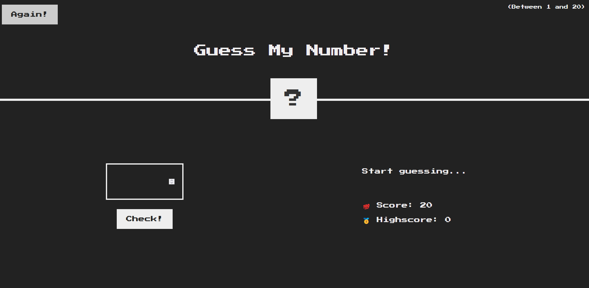

# Guess My Number 🎲

## Overview

"Guess My Number" is a simple yet fun game built using HTML, CSS, and JavaScript. The game generates a random number between 1 and 20, and your goal is to guess it!

## Features

- Random number generation between 1 and 20
- Score tracking
- High score saving
- Dynamic UI updates

## Technologies Used

- HTML
- CSS
- JavaScript

## How to Play

1. Open the game in your web browser.
2. Enter your guess in the input field.
3. Click the "Check" button to submit your guess.
4. The game will provide hints if your guess is too high or too low.
5. Keep guessing until you find the correct number!

## Installation

1. Clone this repository

- git clone https://github.com/alexlux58/guess-my-number.git

2. Open `index.html` in your web browser.

## Contributing

Feel free to fork this repository and make your own changes. Pull requests are welcome!

## License

This project is open-source and available under the MIT License.

## Author

- [Alex](https://github.com/alexlux58)
